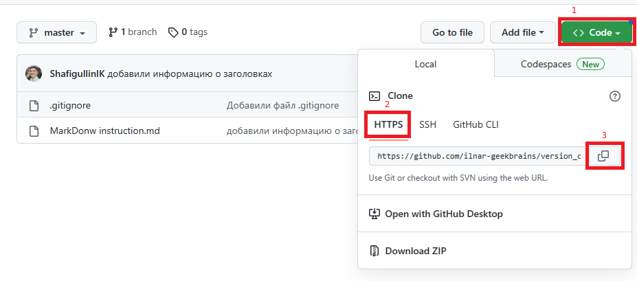
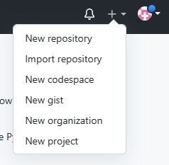
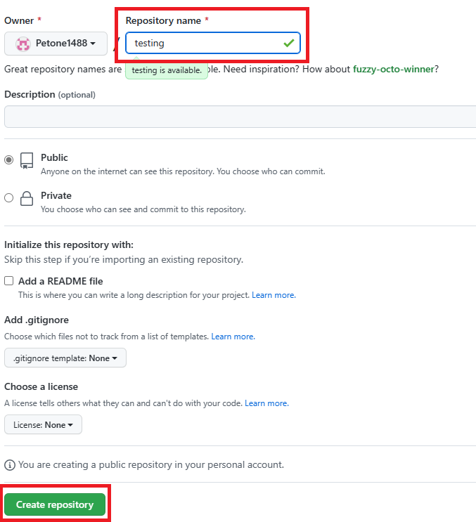
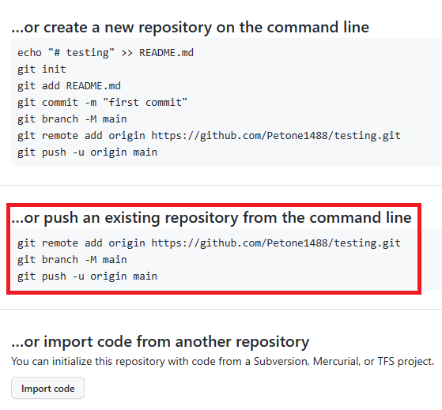

# Работа с Git и GitHub.
***
## 1. Установка Git. 
Загружаем последнюю версию ***Git*** с сайта: <https://git-scm.com/downloads.>
Устанаовливаем с настройками по умолчанию.

Так же для удобства работы с Git необходимо устновить программу ***Visual Studio*** - это лучшая интегрированная среда разработки для создания многофункциональных, привлекательных кроссплатформенных приложений.
***
## 2. Настройка Git.

### Перед началом работы с ***Git*** выполняем следующие действия:
- Для начала создаём на жёстком диске папку в которой мы будем отслеживать все изменения.
- Запускаем программу.
- В левом верхнем углу в меню *Файл* нажимаем *открыть папку* или нажать горячие клавиши "**CTRL + K**".
- Выводим терминал. Для этого необходимо зайти в меню *Вид* далее выбрать *Терминал* или нажать горячие клавиши **"CTRL + "**. Внизу появится поле для ввода команд.
***
## 3. Инструкция для работы с Git.

- В терминале вводим команду **git --version**, для того чтобы понять что ***Git*** у нас установлен и настроен правильно. Если Git устновлен, то появится сообщение с информацией о версии программы (***git version 2.39.1.windows.1***), иначе появится сообщение об ошибке.
- Представимся ***Git***'у командами:

*git config --global* user.email "Ваша почта"

*git config --global* user.name "Ваше имя"
- Инициализируемся командой ***git init***. (Делаем папку репозиторием).
- В нашей папке мы создаём новый файл, нажав правой кнопкой мыши в проводнике выбираем *Создать новый файл* или горячими клавишами ***"CTRL + ALT + Windows + N"***. Обязательно указываем расширение (**.doc, .txt, .md** и так далее).
- Для того чтобы узнать статус, воспользуемся командой ***git status***. (состояние рабочего файла на данный момент).

После выполнения всех вышеуказанных инструкций начинаем работу с файлом в ***Git***

Если опять ввести команду ***git status***, то мы увидим в *терминале* следующее сообщение: 


        Changes not staged for commit:
        (use "git add <file>..." to update what will be committed)
            modified:   GitInstruction.md

 ***Git*** говорит нам что мы можем командой **git add** добавить изменения в рабочий файл, после ввода команды выходит следующее сообщение:

        (use "git restore --staged <file>..." to unstage)
            modified:   GitInstruction.md

Далее мы видим что ***Git*** начал отслеживать наши измения.

После этого мы можем зафиксировать наши изменения командой **git commit -m "Massege"**
Вместо *Massege* мы можем внести текст или сообщение о характере внесённых изменений.
Теперь мы имеем сохранённую версию нашего файла. 

Еще можно использовать команду ***git commit -am "текст"***, она включает в себя команды ***git add*** и ***git commit***. 

Теперь мы можем использовать команду ***git log*** для просмотра своего рода журнала с историями измениий рабочего файла.

        Тестовый комментарий, который мы вводили командой git commit -m "Massege"

        commit ae446d53132888ff24e36819d87901e164d72cae
        Author: Petone1488 <main.mailbox@bk.ru>
        Date:   Sat Feb 11 11:26:02 2023 +0300

В *Терминале* мы увидим сообщение с тектовым комментарием, именем *commit'a*, авторе изменений и электронной почте, для того чтобы можно было связаться с ним. 

Имя *commit'a* необходимо нам для перехода к предыдушим вырсиям файла, для этого мы используем команду ***git checkout commit ae446d53132888ff24e36819d87901e164d72cae***, либо после *commit* можем указать 4 первых символа  ***git checkout commit ae44***.

Так же мы можем использовать команду ***git diff*** для просмотра разницы между существующей версией и сохранённой.

После любых изменений в файле жедательно производить сохранение в меню в левом верхнем углу *Файл* далее *Сохранить* или путём нажатия горячих клавиш **CTRL + S**, так же в меню есть функция автосохранения.

Рекомендуется все изменния сохранять в виде отдельных коммитов *(commit's)*.
***

## 4. Работа с ветками.
Для удобства работы с **Git**, существует такая функция как *"ветки"*. 

Изначально в нашем файле есть одна ветка *"master"*, она считается основной или главной.

Чтобы посмотреть количество веток используемых в файле вводим команду ***git branch***. Та ветка в которой мы находимся на данный момент будет выделена знаком " * ".

Для создания новой ветки вводим команду ***git branch "Name"*** где *"Name"* имя ветки.

После выполнения всех вышеуказанных действий вводим команду ***git branche*** и видим следующее:

        * branches
        master
        PS C:\Users\home\Desktop\Git instuction домашка>

Знаком " * " отмечена ветка, в которой мы находимся.

Для переключения между ветками используется команда ***git checkout branche_name***, где *branche_name* - это название ветки, на которую мы хотим переключится.

Команда ***git checkout -b branche_name*** - создаёт и сразу переключается на созданную ветку.

### 4.1 Сливание веток.

Когда мы перешли в новую ветку и отредактировали нужную информацию, сохраняем её по принципу описанному в разделе 3.

Полсле этого переходим в основную ветку *master* и в ней пишем команду ***git merge "Name"***, где "Name" имя ветки, которую мы хотим влить. После выполнения вышеуказанных действий мы увидим изменения в ветке *master* и в терминале появится сообщение следующего рода:

        Fast-forward
         1 file changed, 39 insertions(+)

В основном ветки используются как черновики.

### 4.2 Разрешение конфликтов при сливании веток.

При сливании веток могут возникнуть конфликты. Причиной этого могут стать ошибки, расхождение в тексте, залипание клавишь при редактировании файлов и т.п.

Если при сливании разных веток происходит так называемый "конфликт", вы увидите следующее сообщение:

        CONFLICT (content): Merge conflict in GitInstruction.md
        Automatic merge failed; fix conflicts and then commit the result.

Программа выделить причины конфликта и предложит вам исправить его в ручную.
После правки обязательно нужно сохранить изменения путём введения команд: 

***git add .*** 

***git commit -m "пояснение корректировки".***

### 4.3 Удаление побочных веток.

Для удобства работы с программой нам необходимо удалять созданные нами побочные ветки, для этого вводим команду ***git branch -d "Name"***, где "Name" имя удаляемой ветки, после в терминале появится сообщение:

        Deleted branch branchesMerges (was 8a18dac).


***
## 5. Работа с изображениями.

Для вставки изображения выполняем следующие действия:
Ставим знак " ! " вначале строки, далее в квадратных скобках [ ] пишем альтернативный текс, которых будет отображаться, если изображение не будет выведено в область предварительного просмотра, далее в круглых скобках ( ) указываем имя файла с изображение, которое должно хранится в нашей папке (с которой мы работаем). Пример: 


***
## 6. Работа с "gitignore".

При работе с репозиториями не принято добавлять фотографии или большие файлы в ***Git***, их обычно игнорируют и работают с текстовой составляющей. Для этого существует файл *".gitignore"* (создаётся в рабочей папке, точка **обязательна**).

В этом файле мы перечисляем то, что ***Git'у*** нужно будет игнорировать.

***
## 7. Знакомство с языком разметки MarkDown.

Для того чтобы видеть интерфейс пользователя необходимо нажать в правом верхнем углу иконку *области предварительного просмотра* или надать горячие клавиши **CTRL+SHIFT+V**

Вот несколько примеров языка разметки:

- Заголовки или списки. Есть 6 типов от больших до маленьких. Перед текстом ставим значок решетка "#" для самого большого и "######" для самого маленького.
- *Курсив* обрамляем текст значком * - звёздочка.
- **Полужирный** обрамляем текст значком ** - 2 звёздочки.
- ***Полужирный крусив*** обрамляем текст значком *** - 3 звёздочки.
- "Список" - ставим звёздочку или дефис перед текстом. 
- Для того чтоб текст был зачёркнут, обрамляем его в знак "~~"  ~~(двойная тильда)~~.
- Используем заголовки 1го и 2го уровня. Для этого под названием ставим знка "=" или знак "-" соответственно:
- "Список" - ставим звёздочку или дефис перед текстом.
- Используем заголовки 1го и 2го уровня. Для этого под предполагаемым заголовком, на следующей строке, ставим знка "=" или знак "-" соответственно (как показано в примере):

***Заголовок***
=
***Заголовок***
-
- При вставке блока кода в список сделайте для него отступ в восемь пробелов или две табуляции.
- Три звездочки подряд ***, или три тире ---, или три символа подчеркивания ___ создают горизонтальную линию.

Строка должна содержать только эти символы, чтобы процессор Markdown правильно интерпретировал горизонтальную линию.
- Для выделения ссылки используем знак "< >" <https://git-scm.com/downloads.>

***
## 8. Работа с GitHub.

### 8.1 Использование репозиториев хранящихся на ***GitHub***.
Для того чтоб взять стороннний репозиторий, необходимо выполнить следующие действия (инструкция выполнена для работы с GitHub):

- Создаём новую папку.
- Заходим на сайт <https://github.com/>.
- В строке поиска в левом верхнем углу мы можем искать разных авторов или проекты,строка поиска показана на картинке ниже:


- После нахождения нужного нам репозитория открывается окно с файлами, в котором необходимо найти и скопировать ссылку для ***Git'a*** как показано на картинке по порядку:



- Далее в программе мы вставляем выбранную ссылку после команды ***git clone "скопированная сслыка"*** и ***Git*** скопирует репозиторий, который находится на сервисе в наш компьютер (локальный репозиторий). После выполнения указанных действий в созданной нами папке появится еще одна папка, с названием, указанным на <https://github.com/>.

- Далее необходимо поместиться в папку, которую мы взяли с сервиса. Сделать это можно командой ***cd "имя папки"*** (change directory). После выполнения всего перечисленного мы сможем работать со скопированным депозиторием, так же как описано в инструкции с использованием всех уже известных команд.

### 8.2 Экспорт своего репозитория на GitHub.

- Для того чтобы выложить свой репозиторий на ***GitHub*** необходимо пройти регистрацию.
- Далее в левом верхнем углу нажимаем на знак " + " и выбираем "New repository" как показано на картинке:



- В следующем окне вводим имя и нажимаем "create repository" как показано на картинке:



- ***Github*** предлагает выполнить несколько выриантов:

1. Создать новый репозиторий *(create a new repository)*,
2. Уже существующий привязать к удалённому репозиторию *(push an existing repository)*,
3. Импортировать код из другого репозитория *(import code from another repository)*.

Нам нужен второй вариант и сервис даёт нам необходимые подсказки для выполнения нужного действия:



- Далее каждую из 3х показанных команд мы последовательно копируем в терминал нашего репозитория в программе ***Git***. Следует обратить внимание, что при первом связывании необходимо пройти авторизацию. (VS code поможет это сделать).

- После обновления страницы вы увидите тот файл, который загружали, на сервисе ***GitHub***
В дальнейшем для добавления внесённой в локальном репозитории информации на сервис ***GitHub*** достаточно ввести команду *git push* в терминале.

- Так же это работает в обратном порядке, то есть если вы изменили файл на другом компьютере или прямо на ***GitHub***, для этого достаточно ввести команду ***git pull***.

- Для создания нового репозитория на ***GitHub*** мы так же можем воспользоваться инструкцией, как показано на картинке:


### 8.3 Участие в других проектах ***GitHub***.

Для того чтобы поучаствовать в каком либо проекте, мы должны этот проект сначала скопировать себе в локальный репозиторий, для этого необходимо:

- Сделать "форк" этого проекта. На сайте <https://github.com/> ищем необходимый проект и на странице этого проекта нажимаем кнопку "Fork", как показано на картинке


- Далее мы клонируем репозиторий на наш компьютер как описано в разделе **8.1**. Обязательно переходим в директорию командой ***cd "имя файла"***, где имя файла является название редактируемого файла.

- Для того чтобы вносить изменения в этом файле необходимо создать новую ветку, подробнее можно прочитать в разделе **4**. Все доработки делаем в новой ветке.

- После внесения изменений обязательно фиксируем все командами ***git add*** и ***git commit***.

- Далее необходимо отправить файл на удалённый репозиторий командой ***git push***, но для этого сначала необходимо связать локальную ветку с удалённой командой 
```

***git push --set-upstream "название ветки"
```

Если ввести команду ***git push*** не производя связку локальной и удалённой веток, то ***Git*** подскажет и досточно будет скопировать подсказанную команду в терминал.

Переходим в удалённый репозиторий обновляем страницу и выбираем вкладку *Pull requests*: 


На следующей странице выбираем:


Далее выбираем в какую ветку мы хотим отправить изменения:


Далее всегда нажимаем *Pull request* 


После выполнения всех вышеперечисленных инструкций изменения будут отправлены автору.

### 8.4 Удаление своих репозиториев из ***GitHub***.

Для удаления созданного вами репозитория, выбираем нужный из списка и заходим в настройки, кнопка *Settings*:


Далее листаем страницу в самый низ и выбираем *Delete this repository*:


Затем следуем инструкции и вводим указанный текс в строку для поддверждения удаления:


**ВНИМАНИЕ:** После выполнения данных действий, репозиторий будет удалён безвозвратно.


